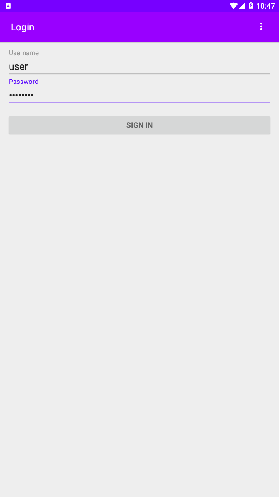
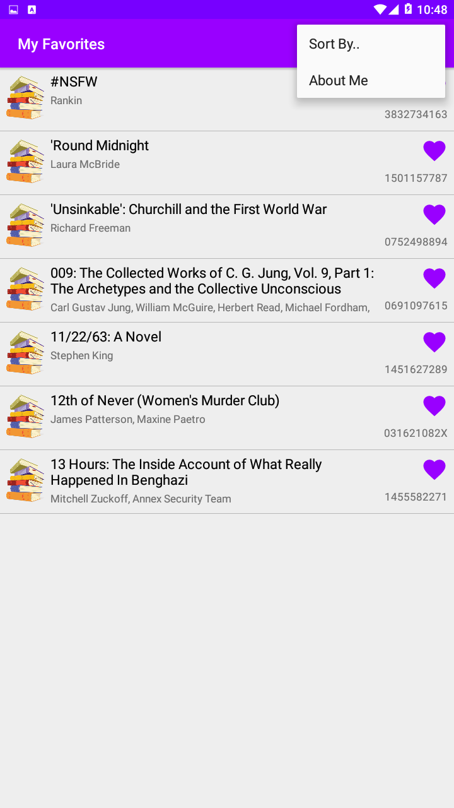
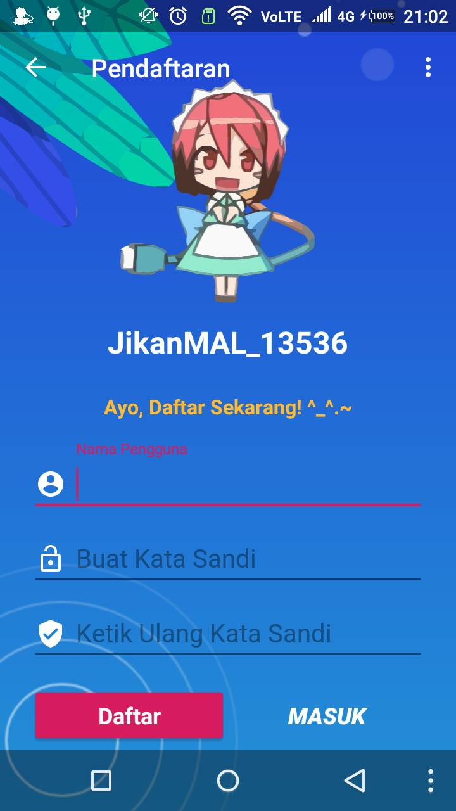

# PM-Mingguan
Tugas Pemrograman Mobile Mingguan + Project UTS/UAS

<hr />

<div style="width: 100%;">
  <p align="center">
    
    
    
    
    
  </p>

  ProjectUTS_00000013536_v2
  > `Books Library Apps`

</div>

<br /><br /><br /><br />
<hr />

<div style="width: 100%;">
  <p align="center">
    
    
    
    
    
    
    
  </p>


</div>

<br /><br /><br /><br />

ProjectUAS_00000013536
> `Anime List with Jikan MyAnimeList API`

```BUG(s) : Margin / Padding Translucent Android Navigation Bar```

<hr />